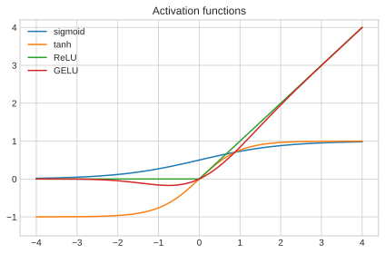

# 7. Activation Functions & Nonlinearity

[← Table of Contents](../../README.md)

## Why nonlinearity?

**Proposition 7.1 (Composition of affine maps is affine).** If
$f(\mathbf{x})=\mathbf{A}\mathbf{x}+\mathbf{a}$ and
$g(\mathbf{x})=\mathbf{B}\mathbf{x}+\mathbf{b}$, then

$$
(g\circ f)(\mathbf{x})=(\mathbf{B}\mathbf{A})\mathbf{x}+(\mathbf{B}\mathbf{a}+\mathbf{b}),
$$

which is affine.

**Proof.** Direct substitution:
$g(f(\mathbf{x}))=\mathbf{B}(\mathbf{A}\mathbf{x}+\mathbf{a})+\mathbf{b}$.
$\blacksquare$

Without nonlinearities between layers, a deep network collapses to one affine
map.

**Theorem 7.2 (Universal Approximation, informal precise statement).** Let
$\sigma$ be a non-polynomial, continuous activation (e.g. sigmoid). For any
continuous function $f$ on a compact set $K\subset\mathbb{R}^n$ and any
$\varepsilon>0$, there exists a one-hidden-layer network

$$
N(\mathbf{x})=\sum_{j=1}^m \alpha_j\,\sigma(\mathbf{w}_j^\top\mathbf{x}+b_j)
$$

with
$\sup_{\mathbf{x}\in K}|N(\mathbf{x})-f(\mathbf{x})|<\varepsilon$.
(Proof omitted; see Cybenko 1989 / Hornik 1991.)

## The main activation functions

### Sigmoid

$$
\sigma(z) = \frac{1}{1+e^{-z}} \in (0,1)
$$

### Tanh

$$
\tanh(z) = \frac{e^{z}-e^{-z}}{e^{z}+e^{-z}} \in (-1,1)
$$

### ReLU (Rectified Linear Unit)

$$
\text{ReLU}(z) = \max(0, z)
$$

### GELU (Gaussian Error Linear Unit)

$$
\text{GELU}(z) = z\,\Phi(z) \approx 0.5\,z\left(1+\tanh\!\big[\sqrt{2/\pi}(z+0.044715 z^3)\big]\right)
$$

## Worked numeric evaluations at $z = -1,\ 0,\ 2$

| $z$ | $\sigma(z)$ | $\tanh(z)$ | $\text{ReLU}(z)$ | $\text{GELU}(z)$ |
|----|----------|---------|---------------|---------------|
| $-1$ | $0.269$ | $-0.762$ | $0$ | $-0.159$ |
| $0$  | $0.500$ | $0.000$  | $0$ | $0.000$ |
| $2$  | $0.881$ | $0.964$  | $2$ | $1.954$ |

*Figure: Activations differ mainly in saturation and slope behavior.*

## Intuition for LLMs

Modern transformers use GELU/SwiGLU in feed-forward blocks. Proposition 7.1 is
why those nonlinearities are mathematically necessary.

---

[← The Perceptron](06-perceptron-linear-models.md) · [Next: Loss & Gradient Descent →](08-loss-gradient-descent.md)
