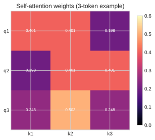
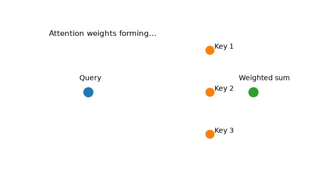

# 10. Self-Attention (the centerpiece)

[← Table of Contents](../../README.md)

## Formal definition

For $\mathbf{X}\in\mathbb{R}^{n\times d_{\text{model}}}$,

$$
\mathbf{Q}=\mathbf{X}\mathbf{W}^Q,\quad
\mathbf{K}=\mathbf{X}\mathbf{W}^K,\quad
\mathbf{V}=\mathbf{X}\mathbf{W}^V,
$$

and

$$
\operatorname{Attn}(\mathbf{X})=
\operatorname{softmax}\!\left(\frac{\mathbf{Q}\mathbf{K}^\top}{\sqrt{d_k}}\right)\mathbf{V}.
$$

Softmax is row-wise.

**Proposition 10.1 (Permutation equivariance).** Let
$\mathbf{P}\in\mathbb{R}^{n\times n}$ be a permutation matrix and define
$\mathbf{X}'=\mathbf{P}\mathbf{X}$. Then

$$
\operatorname{Attn}(\mathbf{X}')=\mathbf{P}\operatorname{Attn}(\mathbf{X}).
$$

So reordering tokens reorders outputs in the same way.

**Proof.** Under permutation,
$\mathbf{Q}'=\mathbf{P}\mathbf{Q}$,
$\mathbf{K}'=\mathbf{P}\mathbf{K}$,
$\mathbf{V}'=\mathbf{P}\mathbf{V}$. Therefore score matrix

$$
\mathbf{S}'=\frac{\mathbf{Q}'(\mathbf{K}')^\top}{\sqrt{d_k}}
=\frac{\mathbf{P}\mathbf{Q}\mathbf{K}^\top\mathbf{P}^\top}{\sqrt{d_k}}
=\mathbf{P}\mathbf{S}\mathbf{P}^\top.
$$

Row-wise softmax commutes with this simultaneous row/column permutation:
$\operatorname{softmax}(\mathbf{P}\mathbf{S}\mathbf{P}^\top)=\mathbf{P}\operatorname{softmax}(\mathbf{S})\mathbf{P}^\top$.
Hence

$$
\operatorname{Attn}(\mathbf{X}')=
\mathbf{P}\operatorname{softmax}(\mathbf{S})\mathbf{P}^\top\mathbf{P}\mathbf{V}
=\mathbf{P}\operatorname{Attn}(\mathbf{X}).
$$

$\blacksquare$

**Proposition 10.2 (Why scale by $1/\sqrt{d_k}$).** Assume entries of
$\mathbf{q},\mathbf{k}\in\mathbb{R}^{d_k}$ are i.i.d., mean $0$, variance $1$,
and independent across vectors. Then

$$
\operatorname{Var}(\mathbf{q}\cdot\mathbf{k})=d_k,
\qquad
\operatorname{Var}\!\left(\frac{\mathbf{q}\cdot\mathbf{k}}{\sqrt{d_k}}\right)=1.
$$

**Proof.** $\mathbf{q}\cdot\mathbf{k}=\sum_{i=1}^{d_k} q_i k_i$.
Each term has mean $0$ and variance
$\mathbb{E}[q_i^2]\mathbb{E}[k_i^2]=1$. Independence gives variance additivity,
so $\operatorname{Var}(\sum_i q_i k_i)=d_k$. Dividing by $\sqrt{d_k}$ divides
variance by $d_k$, yielding $1$. $\blacksquare$

---

## Complete worked example (3 tokens, $d_k = 2$)

Assume we already have

$$
\mathbf{Q} = \begin{bmatrix} 1 & 0 \\ 0 & 1 \\ 1 & 1 \end{bmatrix},\quad
\mathbf{K} = \begin{bmatrix} 1 & 0 \\ 1 & 1 \\ 0 & 1 \end{bmatrix},\quad
\mathbf{V} = \begin{bmatrix} 2 & 0 \\ 0 & 3 \\ 1 & 1 \end{bmatrix}.
$$

### Step 1 — scores $\mathbf{Q}\mathbf{K}^\top$

$$
\mathbf{Q}\mathbf{K}^\top = \begin{bmatrix} 1 & 1 & 0 \\ 0 & 1 & 1 \\ 1 & 2 & 1 \end{bmatrix}.
$$

### Step 2 — scale by $\sqrt{2}$

$$
\begin{bmatrix} 0.707 & 0.707 & 0 \\ 0 & 0.707 & 0.707 \\ 0.707 & 1.414 & 0.707 \end{bmatrix}.
$$

### Step 3 — softmax each row

$$
\mathbf{A} = \begin{bmatrix} 0.401 & 0.401 & 0.198 \\ 0.198 & 0.401 & 0.401 \\ 0.248 & 0.503 & 0.248 \end{bmatrix}.
$$

### Step 4 — multiply by $\mathbf{V}$

$$
\text{Attention output} = \begin{bmatrix} 1.000 & 1.401 \\ 0.797 & 1.604 \\ 0.744 & 1.757 \end{bmatrix}.
$$

*Figure: Attention matrix $\mathbf{A}$ as query-key influence strengths.*

*Animation: Query attends to keys, then forms a weighted value mixture.*

## Causal masking

For decoder-only LLMs, future positions are masked by setting forbidden logits to
$-\infty$ before softmax.

## Intuition for LLMs

Self-attention is mathematically permutation-equivariant (Proposition 10.1), so
position information from [Chapter 12](12-positional-encoding.md) is essential.

---

[← Embeddings](09-embeddings.md) · [Next: Multi-Head Attention →](11-multi-head-attention.md)
