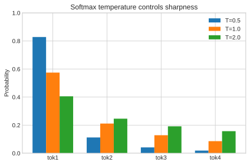
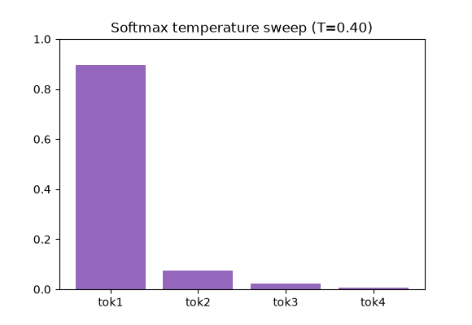

# 15. Inference & Sampling

[← Table of Contents](../../README.md)

At generation time the model outputs a probability distribution over the
vocabulary; we must **choose** a token, append it, and repeat. How we choose
shapes creativity vs. reliability.

Running example logits for 4 candidate tokens:

$$
\mathbf{z} = [2.0,\ 1.0,\ 0.5,\ 0.1].
$$

Plain softmax ($T=1$) gives (see [Chapter 4](../part1-foundations/04-probability-statistics.md)):

$$
e^{2.0}=7.389,\ e^{1.0}=2.718,\ e^{0.5}=1.649,\ e^{0.1}=1.105;\ \text{sum}=12.861.
$$

$$
\mathbf{p} = [0.575,\ 0.211,\ 0.128,\ 0.086].
$$

## Greedy decoding

Always take the highest-probability token → here, token 1. Deterministic, but
repetitive and dull.

## Temperature

Divide logits by temperature $T$ before softmax:

$$
\text{softmax}(\mathbf{z}/T).
$$

**$T = 0.5$ (sharper):** logits become $[4.0, 2.0, 1.0, 0.2]$.

$$
e^{4}=54.6,\ e^{2}=7.389,\ e^{1}=2.718,\ e^{0.2}=1.221;\ \text{sum}=65.93.
$$

$$
\mathbf{p} = [0.828,\ 0.112,\ 0.041,\ 0.019].
$$

More confident, more focused.

**$T = 2.0$ (flatter):** logits become $[1.0, 0.5, 0.25, 0.05]$.

$$
e^{1}=2.718,\ e^{0.5}=1.649,\ e^{0.25}=1.284,\ e^{0.05}=1.051;\ \text{sum}=6.702.
$$

$$
\mathbf{p} = [0.406,\ 0.246,\ 0.192,\ 0.157].
$$

More uniform → more random/creative.

*Figure: Sampling distribution sharpens or flattens as temperature changes.*

*Animation: Increasing temperature spreads probability mass across more tokens.*

## Top-k sampling

Keep only the $k$ highest-probability tokens, renormalize, sample. With $k=2$
on the original $\mathbf{p}=[0.575,0.211,0.128,0.086]$: keep tokens 1 & 2,
renormalize:

$$
\left[\tfrac{0.575}{0.786},\ \tfrac{0.211}{0.786}\right] = [0.732,\ 0.268].
$$

Sample from these two only — the unlikely tail is cut off.

## Top-p (nucleus) sampling

Keep the smallest set of tokens whose cumulative probability $\ge p$. With
$p=0.8$ on $[0.575, 0.211, 0.128, 0.086]$: cumulative $0.575 \to 0.786 \to 0.914$. We cross $0.8$ at the third token, so keep tokens 1–3, renormalize over their sum $0.914$:

$$
[0.629,\ 0.231,\ 0.140].
$$

Unlike top-k, the nucleus size adapts to how peaked the distribution is.

## Intuition for LLMs

- **Low temperature / greedy / small k or p** → factual, deterministic, safe.
- **Higher temperature / larger k or p** → diverse, creative, riskier.

Sampling settings are the main dials users turn to trade off reliability against
creativity.

---

[← Training Objective](14-training-objective.md) · [Next: Scaling & Emergence →](16-scaling-emergence.md)
